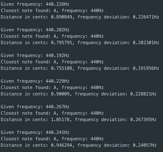

# PMT (Personal Music Tutor)

#### Digital Sound Processing Utilities built with [PortAudio](https://github.com/PortAudio/portaudio), [Aubio](https://github.com/aubio/aubio) and [Qt](https://github.com/qt). The GUI is currently under development.

## Features

* Pitch detection: play sounds close to your input source and get information about their frequency and distance from the closest note. For example, if you play the [440Hz Frequency](https://www.youtube.com/watch?v=xGXYFJmvIvk&ab_channel=dalesnale), your output should look like:

## Key considerations

* The project uses Docker to simplify the development/build experience.
* It currently supports Linux (tested on Ubuntu 18) and Mac (tested on macOS Big Sur).

**NB:** The app may not capture input in built-in terminals like VSCode's.

The current version of pitch detection has not been optimized for different environments/input contexts. Thus, for best results it is advised to use the app in noise-free environments with the sound producing mediums close to the input sources. 

## Requirements to develop/test app

* A microphone
* Brew (Mac only)
* Docker, instructions to install for [Ubuntu](https://docs.docker.com/engine/install/ubuntu/), [Mac](https://docs.docker.com/docker-for-mac/install/). In Linux, you should additionally add your user in the Docker group so that you don't run it as root ([Instructions](https://stackoverflow.com/a/48957722/4129614)).

## To build the app image and fire up a container with an interactive terminal

* `git clone https://github.com/fllprbt/pmt pmt && cd pmt`
* `bash scripts/run.sh`

If everything goes well, you will be connected to the container's terminal

## To run the app

`qmake src/pmt.pro && make && ./pmt`

## Notes to developers

A volume of the codebase is mounted inside the container. Thus, you can edit the project locally and then execute the run commands to recompile and execute your code.
